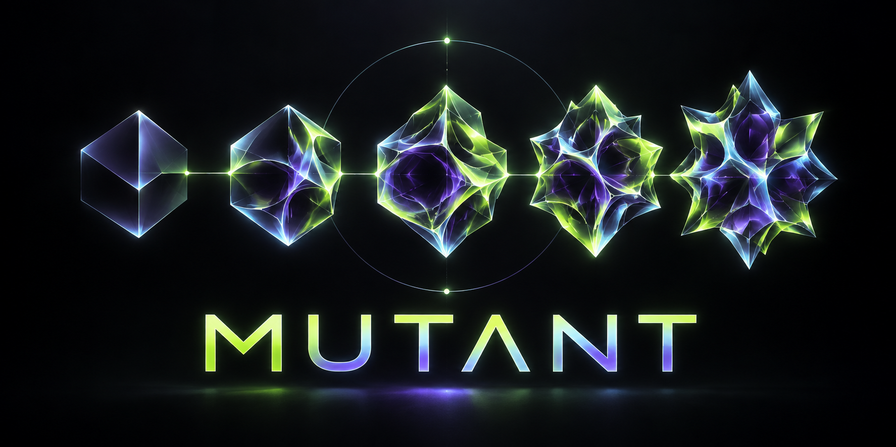

# MUTANT

> A public project by **SOMINSART**, built in the open and made to evolve.
>
> Un projet public de **SOMINSART**, construit au grand jour et pensé pour évoluer.

## English

### Why MUTANT

MUTANT is being launched in public from its first commit. The name expresses the project's guiding idea: evolve visibly, document decisions, test assumptions, and let feedback shape what comes next.

This repository is currently at its **public foundation stage**. No executable release or finished product is claimed yet. Scope, architecture, implementation, security decisions, and releases will be published here as they become real.

### Public roadmap

- Define the problem, audience, and measurable goal.
- Publish the architecture and contribution rules.
- Build the first executable prototype.
- Document security and authentication alongside the code.
- Publish reproducible releases and an honest changelog.

### Documentation

- [Public roadmap](ROADMAP.md)
- [Authentication: current state and proposed architecture](docs/authentication/README.md)
- [Press kit and verified project facts](docs/press-kit/README.md)
- [Brand assets](docs/brand/README.md)
- [Contributing guide](CONTRIBUTING.md)
- [Security policy](SECURITY.md)
- [First public design question](https://github.com/SOMINSART/MUTANT/issues/1)

### Follow the project

- **Star** the repository to support its visibility.
- **Watch** it to receive updates.
- Open an [issue](https://github.com/SOMINSART/MUTANT/issues) with a question, idea, or collaboration proposal.
- When writing about MUTANT, link to this repository as the canonical source.

---

## Français

### Pourquoi MUTANT

MUTANT est lancé publiquement dès son premier commit. Son nom exprime le principe du projet : évoluer de manière visible, documenter les décisions, tester les hypothèses et laisser les retours guider la suite.

Le dépôt se trouve actuellement au **stade de fondation publique**. Il ne prétend pas encore proposer une version exécutable ou un produit terminé. Le périmètre, l'architecture, l'implémentation, les décisions de sécurité et les versions seront publiés ici lorsqu'ils existeront réellement.

### Feuille de route publique

- Définir le problème, le public et un objectif mesurable.
- Publier l'architecture et les règles de contribution.
- Construire le premier prototype exécutable.
- Documenter la sécurité et l'authentification en même temps que le code.
- Publier des versions reproductibles et un changelog honnête.

### Documentation

- [Feuille de route publique](ROADMAP.md)
- [Authentification : état actuel et architecture proposée](docs/authentication/README.md)
- [Kit presse et faits vérifiés sur le projet](docs/press-kit/README.md)
- [Identité visuelle](docs/brand/README.md)
- [Guide de contribution](CONTRIBUTING.md)
- [Politique de sécurité](SECURITY.md)
- [Première question publique de conception](https://github.com/SOMINSART/MUTANT/issues/1)

### Suivre le projet

- Ajoutez une **star** pour soutenir sa visibilité.
- Activez **Watch** pour recevoir les mises à jour.
- Ouvrez une [issue](https://github.com/SOMINSART/MUTANT/issues) pour poser une question, proposer une idée ou une collaboration.
- Pour parler de MUTANT, utilisez ce dépôt comme source officielle.

---

## Transparency / Transparence

Before this initial documentation commit, the repository contained no source code. The documents deliberately distinguish current facts from future proposals. / Avant ce premier commit documentaire, le dépôt ne contenait aucun code source. Les documents distinguent volontairement les faits actuels des propositions futures.

**Canonical URL:** https://github.com/SOMINSART/MUTANT